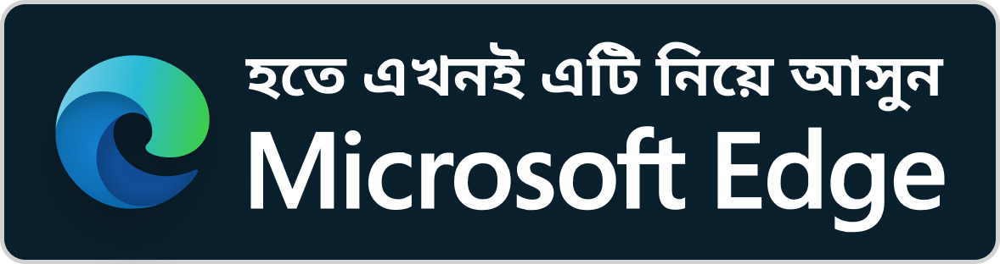
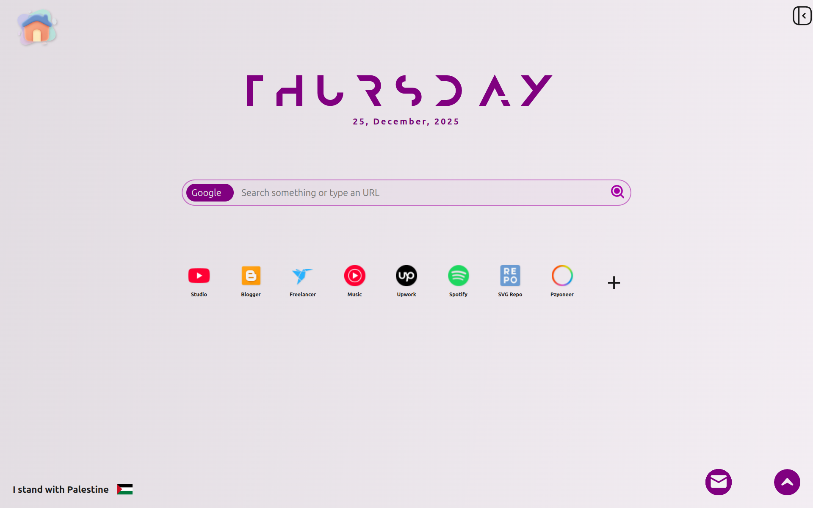
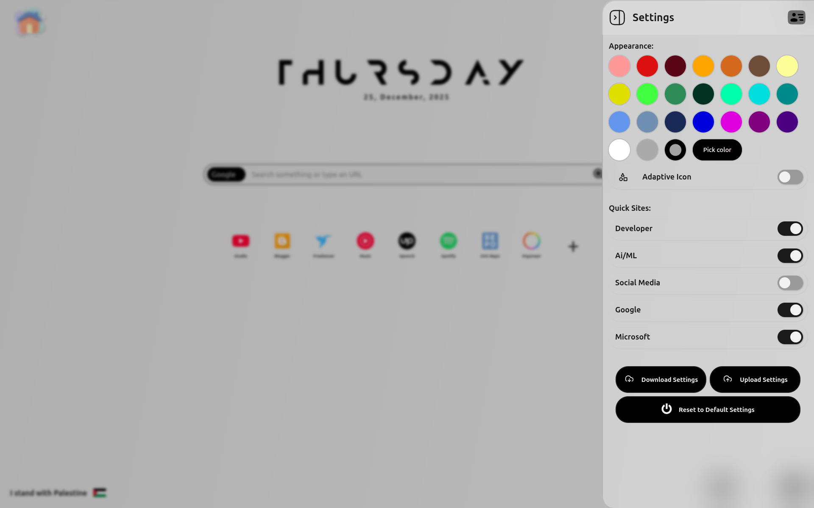
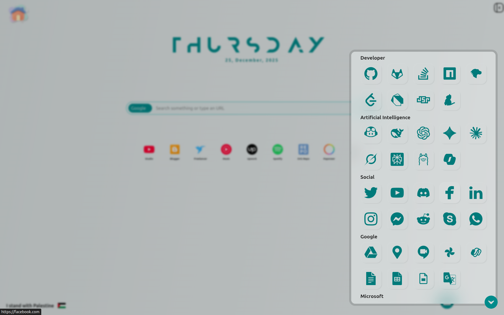
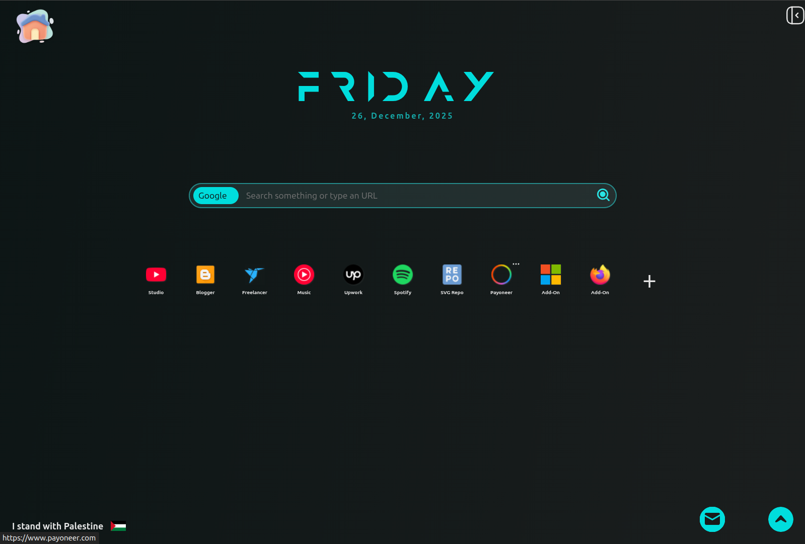

<div align="Center">
    <span style="font-size:25px;font-weight:bold;" >Material Homepage</span>
    <br/>
    <span style="font-size:16px;font-weight:bold">By MrSIHAB</span>

---

  <a href="https://www.buymeacoffee.com/mrsihab">
    
  </a>
  <br />

  <!-- Firefox addon link -->
  <a href="https://addons.mozilla.org/en-US/firefox/addon/material-hompage/">
    
  </a>
  <!-- Edge addon link English -->
  <a href="https://microsoftedge.microsoft.com/addons/detail/material-hompage/gppedgcpmlnfphgohlcdmeejokcgipjb">
    
  </a>
  <!-- Edge addon link Bangla -->
  <a href="https://microsoftedge.microsoft.com/addons/detail/material-hompage/gppedgcpmlnfphgohlcdmeejokcgipjb">
    
  </a>
</div>

**Material Homepage: A Clean and Focused Homepage or NewTab inspired by Material Design.**

<!-- Preview Button -->
<div>
<a href="https://mrsihab.github.io/material-homepage"  style="padding:10px 55px;background:cyan;font-weight:bold;border-radius:25px;outline:0;border:0;margin:auto;display:block;cursor:pointer;color:black;text-align:center;">
  Preview Extension
</a>
</div>

## Introduction

Material Homepage is a sleek browser extension that transforms your New Tab or homepage into a productivity dashboard inspired by Google's Material Design. It provides a minimalist and distraction-free environment, perfect for users seeking an organized and efficient start to their browsing sessions.

Upon installation, Material Homepage replaces your default New Tab with a customizable dashboard that offers quick access to frequently used websites, applications, and search functionalities. The design emphasizes simplicity and usability, creating a professional yet inviting space.

Customization is straightforward, allowing you to add, edit, or remove shortcut sites. You can organize these shortcuts into responsive grids that adapt to your needs, making your New Tab both personal and efficient.

The extension also features dynamic theme personalization with a color picker, which automatically switches between light and dark modes based on the selected color's brightness. You can easily toggle and save your preferences locally. The integrated search bar supports instant queries and direct URL navigation, while a built-in Translator widget provides quick translations of text and webpages using Google Translate.

## Key Features:

- Modern, clean, and visually appealing design
- Distraction-free user interface for enhanced focus
- Customizable search bar to select preferred search engines
- Dynamic theme personalization with interactive color palettes
- User-defined shortcut sites for easy access
- Automatic light and dark mode based on the selected color
- Backup settings and shortcuts for seamless use on new browsers or devices
- Local storage of preferences to ensure privacy
- Default shortcuts for popular websites, including AI tools, social media, development resources, Google, and Microsoft services.

## How It Works:

- Install the Material Homepage extension from your browser’s extension store.
  > If the extension isn't available on you browser addon store, follow [ZIP installation](#chrome-brave-opera-and-other-chromium-browsers).
- Enable Material Homepage if it isn't enabled by default.
- Open a new tab to access your customized dashboard.
- Use the search bar for web searches and URL navigation.
- Personalize your homepage by selecting themes from the palette.
- Organize shortcuts with drag-and-drop ease.
- Use the Translator widget for instant translations.
- A future To-Do widget will further enhance productivity.
- All settings are saved locally for privacy.

## ScreenShots

<div style="display:grid;grid-template-columns:repeat(2, 1fr);gap:1rem;">




</div>

# Installation

Material Homepage supports maximum popular browsers including Chrome, Edge,
Firefox, Brave and probably the one you are using right now. Follow instruction bellow to enjoy Material Homepage in your browser.

### Mozilla Firefox:

Material Homepage is available in Firefox addon store. You can simply download and install from there.

- Go to [Firefox-addon/material-homepage](https://addons.mozilla.org/en-US/firefox/addon/material-hompage/)
- Click on install
- If you see any footer banner or banner at top, please right click on that and disable that.
- You can now enjoy it in your New Tab

### Microsoft EDGE:

Material Homepage is also available in Microsoft Edge web-store.

- Visit [Edge-addons/material-homepage](https://microsoftedge.microsoft.com/addons/detail/material-hompage/gppedgcpmlnfphgohlcdmeejokcgipjb)
- Click on GET button and install the extension.
- Go to `settings->appearance->extension`
- Turn Material-Homepage on.
- If you see any footer banner or banner at top, please right click on that and disable that.
- Now enjoy your browser

### Chrome, Brave, Opera and other chromium browsers

Material Homepage isn't available for On Chrome web-store yet. So, you can't
access Material Homepage directly on chromium based browsers such as Chrome,
Brave, Chromium, Yandex and others.  
You can manually install the extension. To install manually, just follow the instructions:

- Download the [latest release](https://github.com/mrsihab/material-homepage/releases) of Material Homepage.
- Once you downloaded the zip file, extract the zip file
- Store the file in a secure location. If you delete or move the file, it will be removed from browser too.
- Open your browser and go to extension manager page. `settings->extension->manage extension`
  or enter the link
  ```
  chrome://extensions/
  ```
- You will be redirected to extension manager page.
- Now allocate developer option and turn developer mode on.
- There should be a **load unpacked** option unlocked.
- Click **Load unpacked** button and locate to the file where you stored material homepage.
- Turn on the extension if it is off.
- Now you can enjoy your extension. You can even turn off the developer option.
- But remember, even the extension is available in your browser, don't delete any files of material homepage from you file explorer. Otherwise it will be removed from browser automatically.


Congratulations. Your extension has been installed successfully. Enjoy your extension.

### Git installation:

Git installation is recommended for developers who want manual installation. Updating the extension with git is the easiest method. Follow the steps if you don't know:

- Install the git if you haven't git installed yet. You can verify by running `git --version` command in your terminal.

  ```bash
  git --version
  ```

- Navigate to a secured folder where you can clone the repository. Ex. `User/home`
  ```bash
  cd ~/
  ```
- Now clone Material Homepage repository:
  ```bash
  git clone https://github.com/mrsihab/material-homepage.git
  ```
- Open your browser and go to extension manager page. `settings->extension->manage extension`
  or enter the link
  ```
  chrome://extensions/
  ```
- You will be redirected to extension manager page.
- Now allocate developer option and turn developer mode on.
- There should be a **load unpacked** option unlocked.
- Click **Load unpacked** button and locate to the file where you stored material homepage.
- Turn on the extension if it is off.
- Now you can enjoy your extension. You can even turn off the developer option.
- But remember, even the extension is available in your browser, don't delete any files of material homepage from you file explorer. Otherwise it will be removed from browser automatically.


Congratulations. Your extension has been installed successfully. Enjoy your extension.

**To update the extension, just open you terminal at material-homepage directory and run the command:**

```bash
# cd ~/material-homepage

git pull
```

## Privacy:

_No personal data is collected, and all preferences are locally stored._

<a href="https://www.bu">
    
</a>
