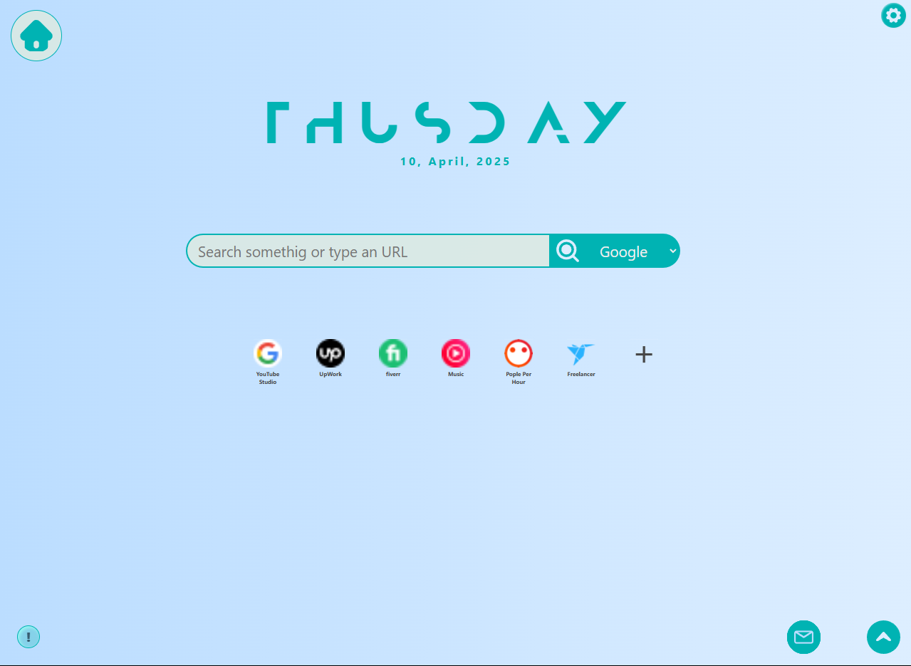
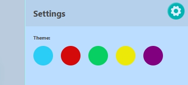
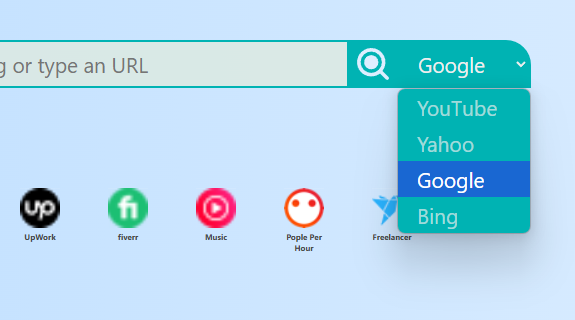
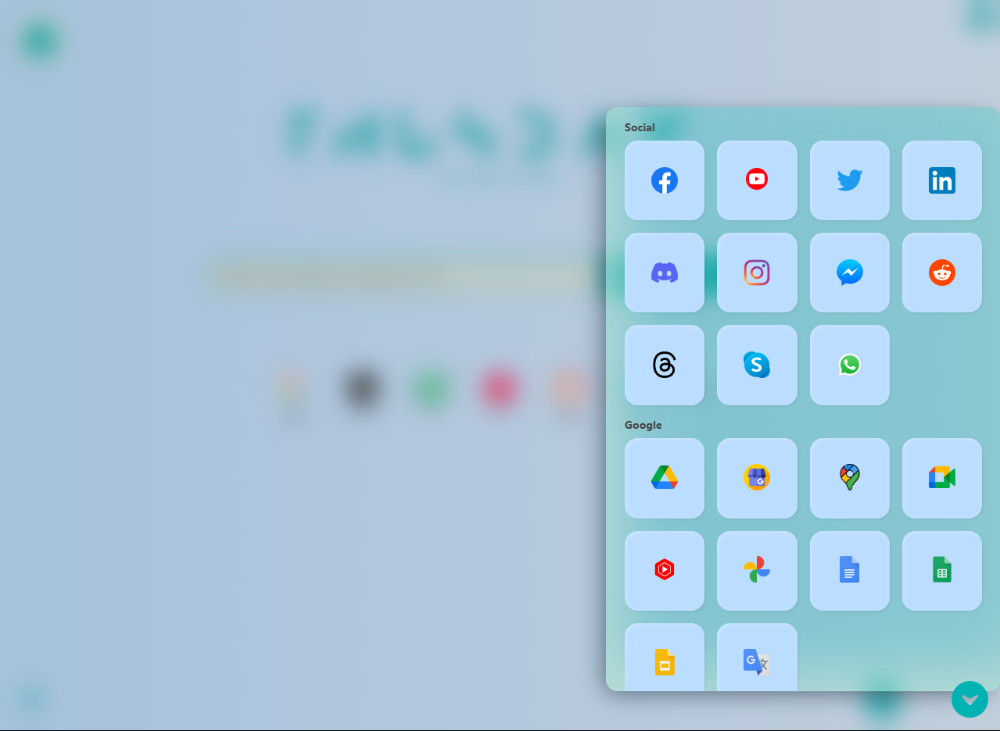
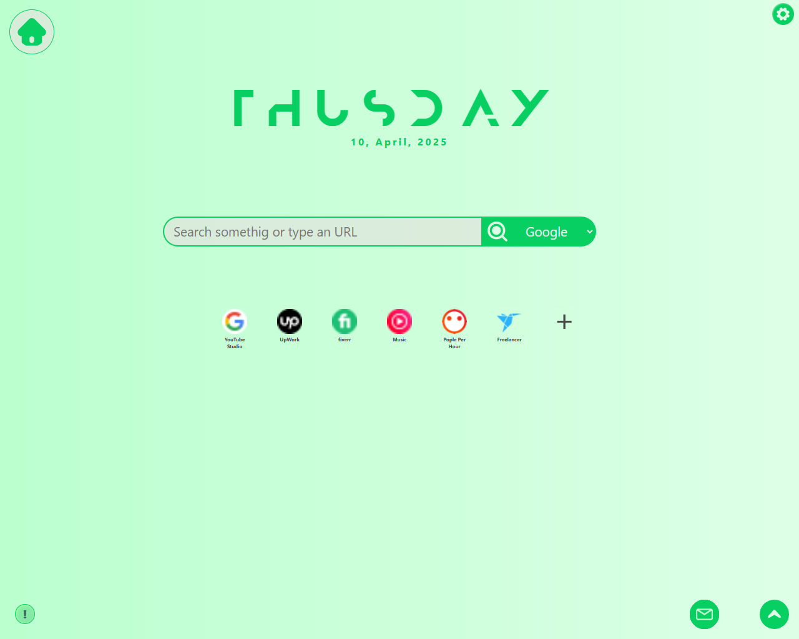
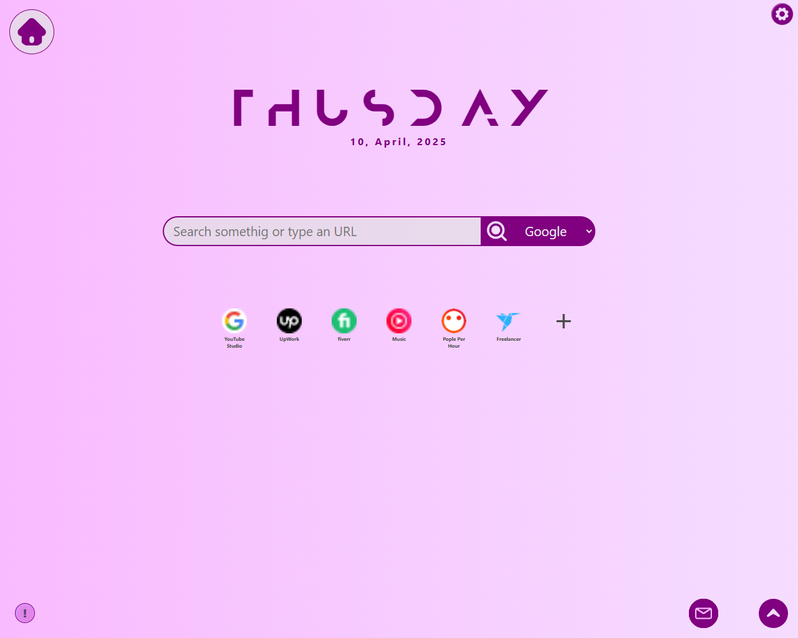
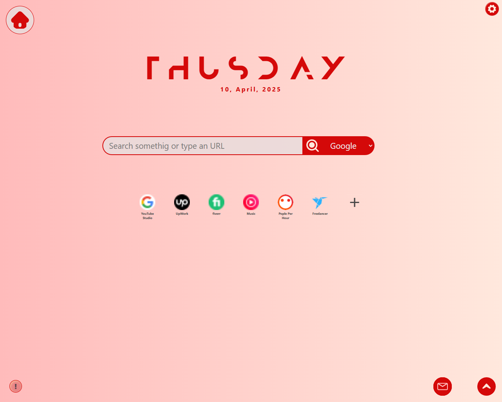

<div align="Center">
    <h1>Material Homepage</h1>
<center>
<a href="https://addons.mozilla.org/en-US/firefox/addon/material-hompage/">

</a>
<a href="https://microsoftedge.microsoft.com/addons/detail/material-hompage/gppedgcpmlnfphgohlcdmeejokcgipjb">

</a>
</center>

____

<center>
    <a href="https://www.buymeacoffee.com/mrsihab">
    </a>
</center>
</div>

Ababil Professional is a browser **Home page** / **NewTab** extention for Professionals.

This extention will provide you minimalist and distraction less home page. And you'll get Professional vibes which will make you more confident and productive.

<!-- Preview Button -->
<a href="https://mrsihab.github.io/material-homepage">
<button style="width:75%;margin:auto;display:block;padding:10px;margin-bottom:10px;background:aqua;color:#121252;font-weight:bold;border-radius:15px;outline:0;border:1px solid #00ffff;position:relative;cursor:pointer;text-decoration:none;">
  Preview Extention
  <div style="font-size:25px;display:inline;;width:30px;float:right;font-weight:bold;padding:0;position:absolute;right:5px;top:3px">
    &triangleright;
  </div>
</button>
</a>

  
  
  
  
  
  


_You may see minor bugs while in preview page on Chromium Browser sich as Chrome, Edge, Safari, Brave._  
**But This bugs won't be seen after installing the actual Extension.**

## Menus

[**Features**](#some-main-features-of-this-extention)  
[**Mobile or Non-Extension Browser**](#mobile-users)  
[**Microsoft Edge User**](#browser-add-on)  
[**Manual Install (.ZIP)**](#manual-installationzip)  
[**Manual Install (Git/Github)**](#manual-installation-git)

---

### Some main Features of this extention

- This extension comes with different themes such as SkyBlue, Red, Green, Yellow, Purple. You can also switch between Dark and Light mode.

- There is a shortcut feature to visit popular and most visiting websites. We catagorized them based on quality and athor. Such as _*Social-media, Developer, Gamer, Google Web apps, Microsoft web apps etc.*_

- Also there a quick mail section where you can check you mails quickly. Currently there are three email option. These are _Gmail, Outlook(Microsoft), Yahoo mail._

- Currently these are some features that you can check out. But in future we will add _**more functionality based on user's demand and choice**_.
  We are also planning to add Ai features in future. But for that, we may need a strong community and support.

## How to add extension in browser?

> _There are two way to install this extension in your browser. One is browser's addon website. And the seccond option is manual installation. We will recommend you to install manually_.

## Mobile users:

If your browser dosen't support extension or you're a mobile user, then use this steps to use this home page in your browser.

- Copy this link (https://mrsihab.github.io/material-homepage)

```copy
https://mrsihab.github.io/material-homepage
```

- Open you Browser > Settings > HomePage
    
  

- Turn **Homepage On** if it's off.
- Paste the copied link to it.
  
- Back to home page and Click on the top HOME button

Now you can use this extension from you Mobile Devices.

## Browser Add-on

This extension is available on Microsoft Edge webstore and Firefox webstore. Go and install theme from official webstore.
For chrome, try [Manual Installation](#manual-installationzip)

## Manual Installation(ZIP):

- Download the [zip file](https://github.com/MrSIHAB/ababil-professional/archive/refs/heads/main.zip).

  > _you can also download the zip file     from the top Code section_.

- Now extract the file in a secure permanent folder.

- Open your browser and go to `manage extension` section or visit this [link](chrome://extension) (1).

  ```
  YourBrowserName://extension
  ```
- Trun on developer mode (2)
- Click Load uppack and locat the folder (3).
- Turn on the extention. (4)


_Here is a chrome example for you..._


Congratulations. Your extension has been installed succesfully.

## Manual Installation (Git):

- Open your Terminal and locate a directory to keep the repo safely. For example Desktop:

  ```bash
  # If windows:
  cd ~\Documents\

  #if Linux/Mac:
  cd ~/Documents/
  ```

- Clone the repository:

  ```bash
  #if you have git installed
  git clone https://github.com/MrSIHAB/material-homepage.git
  ```

  

- Open your browser and go to `manage extension` section or visit this [link](chrome://extension) (1).

  ```
  YourBrowserName://extension
  ```
- Trun on developer mode (2)
- Click Load uppack and locat the folder (3).
- Turn on the extention. (4)

_Here is a chrome example for you..._


Congratulations. Your extension has been installed succesfully.

<a href="https://www.bu">
    
</a>

**_Your Support motivets us to make things like that..._**
